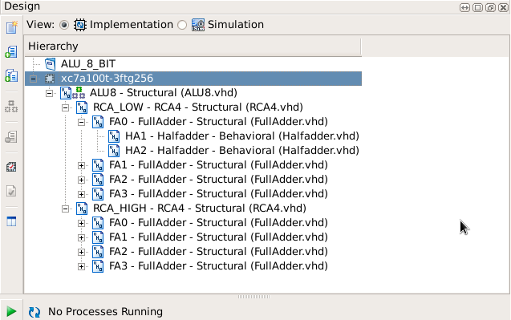

# 8-Bit Arithmetic Logic Unit (ALU) Using Structural VHDL

## Overview

This project presents the design and simulation of an **8-bit Arithmetic Logic Unit (ALU)** using **Structural VHDL** and hierarchical design methodology.

The implementation follows a modular architecture where basic digital building blocks are combined to construct higher-level functional units. The design demonstrates the principles of hierarchical modeling, component reuse, and digital system verification.

The ALU supports arithmetic and logical operations commonly used in processors, microcontrollers, and digital systems.

---

## Key Features

* Hierarchical Structural VHDL Design
* Modular and Reusable Architecture
* 8-bit Arithmetic and Logic Operations
* Ripple Carry Adder Based Arithmetic Unit
* Functional Verification Using Testbench
* RTL Design and Simulation in Xilinx ISE

---

## Supported Operations

| Select Signal | Operation   |
| ------------- | ----------- |
| 00            | Addition    |
| 01            | Logical AND |
| 10            | Logical OR  |
| 11            | Logical XOR |

---

## Design Architecture

The design is implemented using a multi-level hierarchy:

### Level 1

* Half Adder

### Level 2

* Full Adder

### Level 3

* 4-bit Ripple Carry Adder

### Top Level

* 8-bit Arithmetic Logic Unit

This approach improves scalability, maintainability, and verification efficiency.

---

## Tools and Technologies

* VHDL
* Structural Modeling
* Xilinx ISE Design Suite
* ISim Simulator

---

## Repository Structure

```text
ALU-8bit-Structural-VHDL
│
├── src
│   ├── HalfAdder.vhd
│   ├── FullAdder.vhd
│   ├── RCA4.vhd
│   └── ALU8.vhd
│
├── testbench
│   └── tb_ALU8.vhd
│
├── images
│   ├── hierarchy.png
│   ├── rtl_schematic.png
│   └── waveform.png
│
├── report
│   └── project_report.pdf
│
└── README.md
```

---

## Verification

The design was verified through simulation using a dedicated VHDL testbench.

### Test Inputs

```text
A = 10
B = 5
```

### Results

| Operation | Output |
| --------- | ------ |
| Addition  | 15     |
| AND       | 0      |
| OR        | 15     |
| XOR       | 15     |

The observed simulation results matched the expected theoretical outputs.

---

## Design Hierarchy

*Add hierarchy viewer image here*

```markdown

```

---

## RTL Schematic

*Add RTL schematic image here*

```markdown
[RTL Schematic](images/rtl_schematic.png)
```

---

## Simulation Results

*Add simulation waveform image here*

```markdown
[Waveform](images/waveform.png)
```

---

## Applications

* Arithmetic Processing Units
* Embedded Systems
* FPGA-Based Designs
* Digital Signal Processing Systems
* Processor Datapaths
* Educational Digital Design Projects

---

## Learning Outcomes

* Structural VHDL Modeling
* Hierarchical Digital Design
* Combinational Logic Design
* Ripple Carry Adder Implementation
* ALU Design Methodology
* Testbench Development
* Functional Verification

---

## Author

Himanshu Rabha


